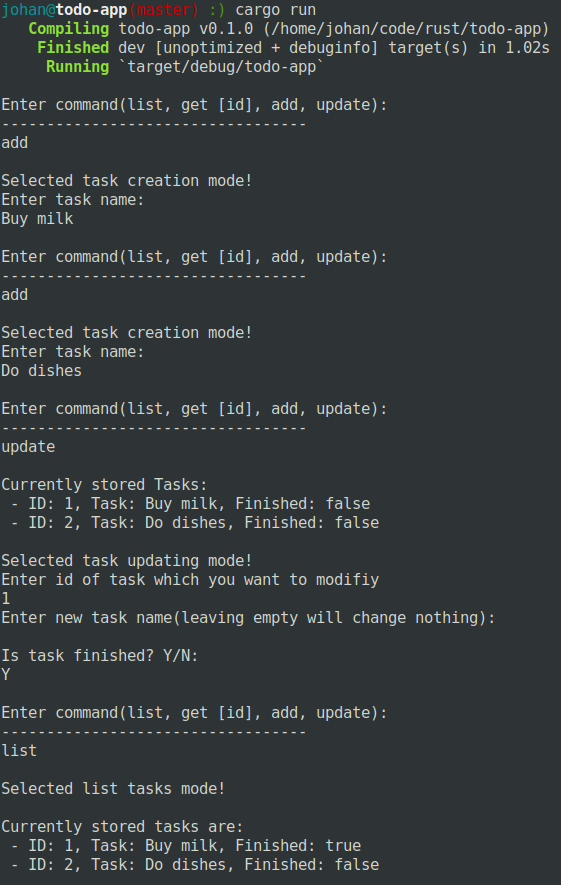

### This is a project where I'm experimenting with rust

Note that this depends on the sqlite library which means that it must exists locally. More details here:
https://github.com/jgallagher/rusqlite#notes-on-building-rusqlite-and-libsqlite3-sys
I have this in my environment:

```shell
SQLITE3_LIB_DIR=/usr/lib/x86_64-linux-gnu/
```

```bash
#Fetch dependencies
cargo build
#Run
cargo run
```

## This project has both a cli interface and a grpc server

### Cli

```shell
cargo run --bin cli -- --help
```

**Demo usage**



### GRPC-server

```shell
cargo run --bin server -- --help
```

